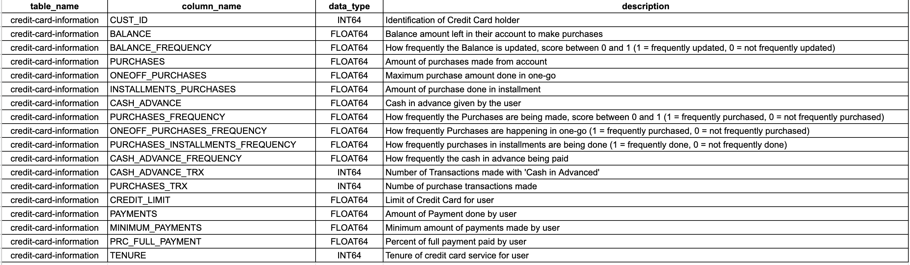

[](https://classroom.github.com/a/Hu7WTvIV)
# Graded Challenge 6 - Set 1

_Graded Challenge ini dibuat guna mengevaluasi pembelajaran pada Hacktiv8 Data Science Fulltime Program khususnya pada konsep Clustering_

_version: GAIAv2.4_

_update date: 20260509_

---

## Objectives

*Graded Challenge 6* ini dibuat dengan tujuan sebagai berikut:

- Mampu memperoleh data menggunakan Google BigQuery.

- Mampu mempersiapkan data untuk digunakan dalam Clustering.

- Mampu memahami konsep Clustering dengan menggunakan Scikit-Learn.

- Mampu mengimplementasikan Clustering pada data yang telah ditentukan.

---

## Dataset

1. Pada tugas kali ini, dataset yang digunakan **tidak akan menggunakan `bigquery-public-data`**. 

2. Masuk ke dalam Google BigQuery. Gunakan informasi dibawah ini sebagai tempat untuk mengambil data (gunakan sebagai informasi untuk klausa `FROM`).
   * Project ID : `ftds-hacktiv8-project`
   
   * Dataset Name : 
     
     + Batch Offline : `phase1_ftds_<nomor-batch>_hck` contoh `phase1_ftds_001_hck`

     + Batch Online : `phase1_ftds_<nomor-batch>_rmt` contoh `phase1_ftds_001_rmt`

     + Batch BSD : `phase1_ftds_<nomor-batch>_bsd` contoh `phase1_ftds_001_bsd`
   
   * Table Name : `credit-card-information`

3. Ambil data dengan kriteria berikut ini : 
   * Batch ganjil (FTDS-001, FTDS-003, dst) : semua data dengan column `CUST_ID` bernilai ganjil.
   
   * Batch genap (FTDS-002, FTDS-004, dst) : semua data dengan column `CUST_ID` bernilai genap.

4. Berikut ini adalah informasi dari setiap column. 
   

5. Simpan dataset dalam bentuk `.csv` dengan nama `P1G6_<nama_students>.csv` misal `P1G6_raka_ardhi.csv`.

6. Salin query yang telah dibuat di Google Cloud Platform. Tulislah pada bagian atas notebook!

7. Tampilkan `10 data pertama` dan `10 data terakhir` dari dataset pada notebook !

---

## Problem

Anda adalah seorang Data Scientist disebuah perusahaan bernama Bank Berlian. Tim marketing meminta anda untuk melakukan Customer Segmentation dari data kartu kredit yang sudah Anda peroleh sebelumnya. Data ini merupakan data informasi penggunaan kartu kredit selama 6 bulan terakhir. 

Atas permintaan tersebut, Anda akan membuat proses Clustering dan memberikan rekomendasi bisnis dari setiap Customer Cluster yang terbentuk. Selain itu, tim marketing juga meminta insight bisnis lain dari data yang Anda gunakan yang akan Anda jawab pada bagian Exploratory Data Analysis (EDA). 

***Note : Anda diwajibkan untuk menjawab pertanyaan-pertanyaan dibawah ini. Untuk menjawab soal dibawah ini, mohon tulis ulang masing-masing soal didalam markdown notebook. Anda juga dipersilakan untuk melakukan Exploratory Data Analysis (EDA) lain dan analisa model lainnya pada bagian Model Evaluation diluar dari pertanyaan yang diminta.***

### Lakukan pada bagian Exploratory Data Analysis (EDA)

1. Apakah terdapat pola antara pengaruh `TENURE` dengan variabel `PURCHASES`, `BALANCE`, dan `PAYMENTS` ? *Buatlah uji statistik dan plot visualisasi yang menunjukkan hubungan ini. Berikan juga rekomendasi bisnis untuk tim marketing mengenai hal ini.*

2. Apakah nasabah dengan `CREDIT_LIMIT` yang tinggi cenderung lebih sering melakukan pembelian ? Lakukanlah analisis untuk mengetahui bagaimana `CREDIT_LIMIT` mempengaruhi frekuensi pembelian (`PURCHASES_FREQUENCY`). Buatlah visualisasi yang menunjukkan hubungan ini dan berikan rekomendasi bisnis untuk tim marketing mengenai hal ini.

### Lakukan pada bagian Model Inference

Terdapat seorang user yang memiliki data dibawah ini. Berikan prediksi mengenai jenis cluster dari user dibawah ini.

| Column | Value |
| --- | --- | 
| `CUST_ID` | 9999 |
| `BALANCE` | 2000 |
| `BALANCE_FREQUENCY` | 0.5 |
| `PURCHASES` | 1000 |
| `ONEOFF_PURCHASES` | 600 |
| `INSTALLMENTS_PURCHASES` | 800 |
| `CASH_ADVANCE` | 500 |
| `PURCHASES_FREQUENCY` | 5 |
| `ONEOFF_PURCHASES_FREQUENCY` | 0.5 |
| `PURCHASES_INSTALLMENTS_FREQUENCY` | 0.7 |
| `CASH_ADVANCE_FREQUENCY` | 0.3 |
| `CASH_ADVANCE_TRX` | 3 |
| `PURCHASES_TRX` | 20 |
| `CREDIT_LIMIT` | 5000 |
| `PAYMENTS` | 800 |
| `MINIMUM_PAYMENTS` | 500 |
| `PRC_FULL_PAYMENT` | 0.2 |
| `TENURE` | 12 |

---

## Instructions

*Graded Challenge 6* dikerjakan dalam format ***notebook*** dengen beberapa **kriteria wajib** di bawah ini:

* Machine learning framework yang digunakan adalah *Scikit-Learn*.

* Terdapat penggunaan library visualisasi, seperti *matplotlib*, *seaborn*, atau yang lain.

* Isi notebook harus mengikuti outline di bawah ini:
   1. Perkenalan
      > Bab pengenalan harus diisi dengan identitas, gambaran besar dataset yang digunakan, dan objective yang ingin dicapai sehingga jelas latar belakang pembuatan model dan peruntukan penggunaannya. Tuliskan juga algoritma, metrics evaluasi, dan user yang menggunakan model Anda.
   
   2. Query SQL
      > Tulis query yang telah dibuat untuk mengambil data dari Google Cloud Platform di bagian ini.

   3. Import Libraries
      > Cell pertama pada notebook **harus berisi dan hanya berisi** semua library yang digunakan dalam project. Pastikan Anda hanya melakukan import library diawal notebook dan hanya melakukan import library yang memang-memang benar-benar dipakai.
   
   4. Data Loading
      > Bagian ini berisi proses penyiapan data sebelum dilakukan eksplorasi data lebih lanjut. Proses Data Loading dapat berupa memberi nama baru untuk setiap kolom, mengecek ukuran dataset, dll.
   
   5. Exploratory Data Analysis (EDA)
      > Bagian ini berisi eksplorasi data pada dataset diatas dengan menggunakan query, grouping, visualisasi sederhana, dan lain sebagainya. **Jawab pertanyaan mengenai EDA yang telah ditentukan pada bagian ini. Anda juga dipersilakan melakukan eksplorasi lain mengenai EDA diluar dari pertanyaan yang diberikan diatas.**
   
   6. Feature Engineering
      > Bagian ini berisi proses mempersiapkan data untuk digunakan saat pelatihan model, seperti transformasi data (normalisasi, scaling, dll.), dan proses-proses lain yang dibutuhkan. Tuliskan alasan Anda melakukan suatu teknik Feature Engineering agar terlihat kesesuaiannya dengan project yang dihadapi. Jikalau Anda memutuskan untuk tidak melakukan suatu teknik Feature Engineering, Anda juga wajib menuliskannya sehingga perspektif Anda dalam membuat model dapat dipahami.
   
   7. Model Definition
      > Bagian ini berisi cell untuk mendefinisikan model. Jelaskan alasan menggunakan suatu algoritma/model, hyperparameter yang dipakai, jenis penggunaan metrics yang dipakai, dan hal lain yang terkait dengan model.

   8. Model Training
      > Cell pada bagian ini hanya berisi code untuk melatih model dan output yang dihasilkan. Lakukan beberapa kali proses training dengan hyperparameter yang berbeda untuk melihat hasil yang didapatkan. Analisis dan narasikan hasil ini pada bagian Model Evaluation.

   9. Model Evaluation
      > Pada bagian ini, dilakukan evaluasi model yang harus menunjukkan bagaimana performa model berdasarkan metrics yang dipilih. Hal ini harus dibuktikan dengan visualisasi tren performa dan/atau tingkat kesalahan model. **Lakukan evaluasi terhadap hasil cluster yang terbentuk dengan menggunakan minimal 2 teknik berbeda. Lakukan analisis terkait dengan hasil pada model dan tuliskan hasil analisisnya**. 

   10. Model Saving
       > Pada bagian ini, dilakukan proses penyimpanan model dan file-file lain yang terkait dengan hasil proses pembuatan model. Pilihlah 1 model yang terbaik berdasarkan hasil evaluasi sebelumnya. **Nyatakan secara jelas model mana yang Anda anggap sebagai model terbaik.**

   11. Model Inference
       > Model yang sudah dilatih akan dicoba pada data yang bukan termasuk ke dalam train-set. Data ini harus dalam format yang asli, bukan data yang sudah di-scaled.**Model Inference harus berada pada notebook yang berbeda dari notebook yang dipakai untuk pembuatan model.**

   12. Pengambilan Kesimpulan
       > Pada bagian terakhir ini, **harus berisi** kesimpulan yang mencerminkan hasil yang didapat dengan objective yang sudah ditulis di bagian Perkenalan. Berikan juga Further Improvement untuk memperbaiki performansi yang didapat. Tulislah hal tersebut dibagian ini dan detailkan cara perbaikan yang Anda sarankan (dapat ditambah dengan referensi eksternal, step-by-step teknis, dll).
    
---

## Submission

* Simpan assignment pada sesi ini dengan nama :
  - Modeling : `P1G6_<nama-student>.ipynb`, misal `P1G6_raka_ardhi.ipynb`.
  - Model Inference : `P1G6_<nama-student>_inf.ipynb`, misal `P1G6_raka_ardhi_inf.ipynb`.
  - Dataset : `P1G6_<nama_students>.csv` misal `P1G6_raka_ardhi.csv`.

* Push assignment yang telah Anda buat ke akun GitHub Classroom Anda masing-masing.

* Sebelum Anda submit, pastikan untuk melakukan running ulang (`Restart` dan `Run All`) code yang telah Anda buat. Hal ini bertujuan untuk memastikan tidak ada bagian code yang mengalami error dan tidak ada perbedaan antara hasil yang didapat Student dengan Instruktur. 
   - Sesegera mungkin ketika telah dilakukan running ulang, notebook dimasukkan ke dalam repository.
   - Hal ini agar `Nomor Eksekusi` di Python Notebook (ditandai dengan angka di dalam kurung siku `[ ]` disamping code cell) dapat terlihat urutannya.

---

## Rubrics

<table><thead><tr><th>Criteria</th><th>Expectations &amp; Hints</th></tr></thead><tbody><tr><td rowspan="2">SQL</td><td>Expectation : Mampu melakukan query data dengan kriteria yang telah diberikan. - 10 Points</td></tr><tr><td>Hints : <br><br>1. Koneksikan notebook yang Anda buat dengan Google BigQuery. <br><br>2. Lakukan query data dengan menuliskan sintaks SQL ke dalam notebook sesuai dengan kriteria yang diberikan. <br><br>3. Buat sintaks Python untuk menyimpan hasil query ini ke dalam file CSV. Pastikan Anda juga mengupload file CSV ini ke dalam repository GitHub.<br><br>4. Lakukan Data Loading dari file CSV ini dan tampilkan 10 data pertama dan 10 data terakhir.</td></tr><tr><td rowspan="2">Feature Enginering</td><td>Expectation : Mampu melakukan preprocessing dataset sebelum melakukan proses modeling (normalisasi, scaling, dll). - 25 Points</td></tr>
<tr><td>Hints : <br><br>1. Lakukan berbagai macam Feature Engineering seperti yang pernah dibahas saat lecture di Week 1 seperti cek duplikasi data, Handling Cardinality, Handling Missing Values, Handling Outlier, Feature Selection, Feature Scaling, dll. <br><br>2. Anda dipersilakan untuk melakukan Feature Engineering lain yang tidak diajarkan saat lecture. <br><br>3. Tuliskan alasan Anda melakukan suatu teknik Feature Engineering agar terlihat kesesuaiannya dengan project yang dihadapi. <br><br>4. Jikalau Anda memutuskan untuk tidak melakukan suatu teknik Feature Engineering, Anda juga wajib menuliskannya sehingga perspektif Anda dalam membuat model dapat dipahami. <br><br>5. Contoh : jika Anda memutuskan untuk tidak melakukan Handling Outlier, tetap tuliskan alasan mengenai hal ini. Sertakan referensi yang mendukung keputusan Anda.</td></tr><tr><td rowspan="2">PCA</td><td>Expectation : Mampu melakukan reduksi dimensi dengan menggunakan PCA. - 10 Points</td></tr>
<tr><td>Hints : <br><br>1. Lakukan pengecekan terlebih dahulu berapa banyak jumlah komponen yang hendak Anda reduksi.<br><br>2. Berikan narasi/analisa mengenai jumlah komponen yang hendak Anda reduksi seperti alasan dipilihnya suatu jumlah komponen, dampak yang akan terjadi, dll.<br><br>3. Lakukan reduksi dimensi berdasarkan hasil analisa yang telah Anda lakukan.</td></tr><tr><td rowspan="2">KMeans</td><td>Expectation : Mengimplementasikan KMeans dan menentukan hyperparameter yang tepat dengan Scikit-Learn. - 10 Points</td></tr><tr><td>Hints : Lakukan proses training model dengan menggunakan KMeans.</td></tr><tr><td rowspan="2">Model Inference</td><td>Expectation : Mencoba model yang telah dibuat dengan data baru yang telah ditentukan - 10 Points</td></tr>
<tr><td>Hints : <br><br>1. Pastikan Anda hanya melakukan Model Inference di notebook yang berbeda dari notebook untuk Model Training.<br><br>2. Lakukan Model Inference hanya pada model yang terbaik diantara berbagai model yang Anda buat.</td></tr><tr><td rowspan="2">Runs Perfectly</td><td>Expectation : Kode berjalan tanpa ada error. Seluruh kode berfungsi dan dibuat dengan benar. - 10 Points</td></tr>
<tr><td>Hints : <br><br>1. Sebelum Anda submit, pastikan untuk melakukan running ulang (`Restart` dan `Run All`) code yang telah Anda buat. <br><br>2. Hal ini bertujuan untuk memastikan tidak ada bagian code yang mengalami error dan tidak ada perbedaan antara hasil yang didapat Student dengan Instruktur. <br><br>3. Sesegera mungkin ketika telah dilakukan running ulang, notebook dimasukkan ke dalam repository.<br><br>4. Hal ini agar `Nomor Eksekusi` di Python Notebook (ditandai dengan angka di dalam kurung siku `[ ]` disamping code cell) dapat terlihat urutannya. <br><br>5. Setelah Anda submit notebook jawaban ke dalam repository, silakan cek kembali notebook jawaban Anda di repositorynya. Pastikan bahwa `Nomor Eksekusi` masing-masing cell terlihat.<br><br>6. Pastikan juga bahwa `Nomor Eksekusi` berurutan dari `1` hingga akhir code yang Anda buat, tidak melompat-lompat (ada `Nomor Eksekusi` yang hilang).</td></tr>
<tr><td rowspan="2">Readability</td><td>Expectation : Semua baris kode terdokumentasi dengan baik dengan Markdown untuk penjelasan kode. - 15 Points</td></tr><tr><td>Hints : <br><br>1. Terdapat section Perkenalan yang jelas dan lengkap terkait latar belakang masalah yang akan diselesaikan, tujuan akhir yang hendak dicapai, algoritma yang digunakan, dan teknik evaluasi yang dipakai. <br><br>2. Tidak menyalin markdown dari tugas lain. <br><br>3. Import library rapih (terdapat dalam 1 cell dan tidak ada unused libs). <br><br>4. Pemakaian fungsi markdown yang optimal (Heading, text formating, dll). <br><br>5. Terdapat komentar pada setiap baris kode. <br><br>6. Adanya pemisah yang jelas antar section, dll. <br><br>7. Tidak adanya typo.</td></tr><tr><td rowspan="2">Model Analysis</td><td>Expectation : Mampu menganalisa informasi dari model yang telah dibuat. Gunakan minimal 2 teknik berbeda untuk mengevaluasi hasil cluster yang terbentuk. - 15 Points</td></tr>
<tr><td>Hints :<br><br>1. Terdapat penjelasan mengenai alasan penggunaan suatu metrics evaluasi.<br><br>2. Terdapat penjelasan macam-macam hasil metrics evaluasi dan interpretasinya terhadap kasus yang diselesaikan. <br><br>3. Dapat menjelaskan KELEBIHAN dan KELEMAHAN dari model yang dibuat DENGAN KAITANNYA DENGAN DOMAIN BUSINESS YANG DIHADAPI yang dibuktikan dengan eksplorasi sederhana (grafik, plot, teori, dll). <br><br>4. Dapat memberikan kesimpulan mengenai model mana yang dianggap sebagai model terbaik diantara beberapa model yang dibuat dengan alasan yang tepat.<br><br>5. Terdapat visualisasi hasil cluster yang terbaik ke dalam ruang 2D.</td></tr><tr><td rowspan="2">Overal Analysis</td><td>Expectation : Mampu menarik informasi/kesimpulan dari keseluruhan kegiatan yang dilakukan. - 34 Points</td></tr>
<tr><td>Hints : <br><br>1. Code beserta jawaban dari pertanyaan mengenai Exploratory Data Analysis dibuat dengan benar.<br><br>2. Dapat menyebutkan insight yang dapat diambil setelah proses EDA, dll. <br><br>3. Dapat memberikan statement untuk improvement selanjutnya dari model yang dibuat dengan didukung oleh suatu eksplorasi atau stua referensi eksternal.<br><br>4. Terdapat eksplorasi mengenai karakteristik dari masing-masing cluster yang terbentuk sehingga jelas perbedaan antar clusternya dan rekomendasi bisnis setiap clusternya.</td></tr></tbody></table>

---

```
Total Points : 139
```

---

## Notes

* Pastikan Anda untuk membaca dan memahami secara seksama mengenai file README ini. 

* Deadline : 
  - Default : Phase 1 Week 3 Day 7 (Sunday) pukul 18:00 WIB.
  - Silakan cek kembali mengenai deadline tugas ini pada repository Anda atau silakan tanyakan ke instruktur/buddy Anda.

* **Keterlambatan pengumpulan tugas mengakibatkan skor GC 6 menjadi 0.**
